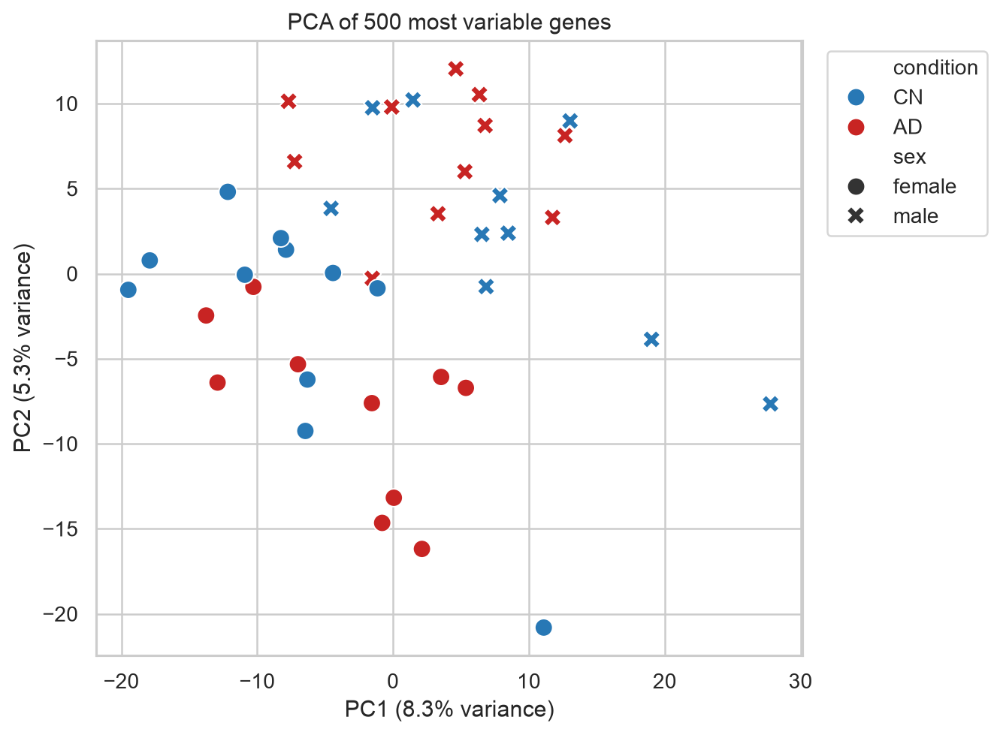
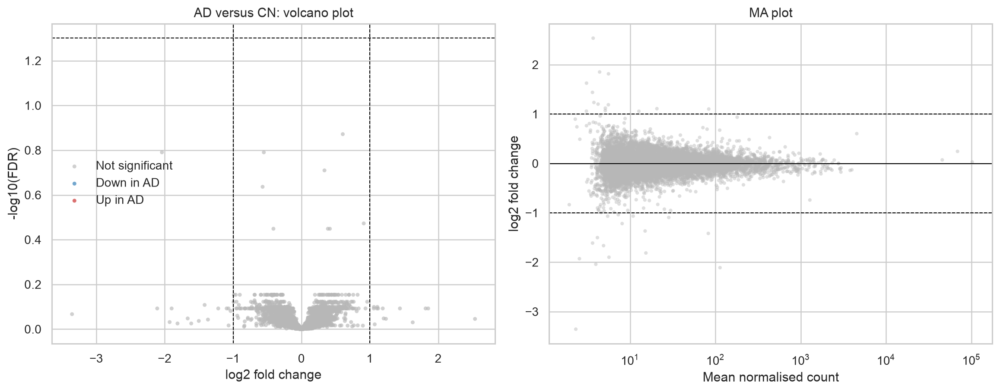

# Blood transcriptomics in Alzheimer's disease

A complete, reproducible RNA-seq analysis of the public
[GSE249477](https://www.ncbi.nlm.nih.gov/geo/query/acc.cgi?acc=GSE249477)
peripheral-blood dataset. The project combines a documented FASTQ-to-count
workflow with a statistically valid analysis of all 21 Alzheimer's disease
(AD) and 21 cognitively normal (CN) samples.

## Results in brief

- Primary cohort: 21 AD and 21 CN samples
- Model: `expression ~ centred age + sex + condition`
- Genes retained after pre-filtering: 9,137
- Genes at FDR < 0.05: **0**
- Hallmark pathways at FDR < 0.05: **0**
- PCA: extensive overlap between AD and CN samples

The analysis does not claim a validated blood biomarker. `MPO` had a nominal
AD increase (log2 fold change 1.06; raw p = 0.021), but the result did not
survive transcriptome-wide correction (FDR 0.794). Reporting this null result
honestly is central to the project.





## What the project demonstrates

- SRA retrieval, FastQC/MultiQC, STAR mapping, BAM QC, IGV inspection and
  featureCounts documentation
- Parsing a non-standard GEO count matrix and GEO SOFT metadata
- Explicit validation and exclusion of malformed source rows
- Cohort definition and confounder-aware study design
- DESeq2 median-of-ratios normalization
- Negative-binomial differential-expression modelling with PyDESeq2
- Multiple-testing correction and effect-size thresholds
- PCA, volcano/MA plots, heatmaps and candidate-gene review
- Pre-ranked Hallmark gene-set enrichment analysis
- Critical interpretation of negative results and study limitations

## Reports

- [`notebooks/01_rnaseq_analysis.ipynb`](notebooks/01_rnaseq_analysis.ipynb) —
  complete executed 42-sample statistical analysis
- [`notebooks/02_processing_and_QC.ipynb`](notebooks/02_processing_and_QC.ipynb) —
  executed processing and quality-assessment companion
- [`reports/01_rnaseq_analysis.html`](reports/01_rnaseq_analysis.html) — portable
  HTML report with embedded figures
- [`reports/02_processing_and_QC.html`](reports/02_processing_and_QC.html) —
  portable processing/QC report

## Repository structure

```text
.
├── notebooks/            # complete executed Jupyter notebooks
├── reports/              # matching standalone HTML reports
├── scripts/              # downloads, parsing and validation
├── resources/            # Hallmark gene-set definitions
├── results/
│   ├── figures/          # figures written by the analysis
│   └── tables/           # differential expression and GSEA results
├── data/
│   └── raw/              # downloaded GEO inputs (not tracked by Git)
├── sample_manifest.tsv   # public sample/run manifest
└── requirements.txt
```

## Reproduce the analysis

Python 3.11–3.13 is recommended.

```bash
python3 -m venv .venv
source .venv/bin/activate
python -m pip install -r requirements.txt
python scripts/download_data.py
python scripts/validate_inputs.py \
  data/raw/GSE249477_raw_count_normalize_04-10-2025.csv.gz \
  data/raw/GSE249477_family.soft.gz
jupyter nbconvert --execute --to notebook --inplace \
  notebooks/01_rnaseq_analysis.ipynb
jupyter nbconvert --execute --to notebook --inplace \
  notebooks/02_processing_and_QC.ipynb
python scripts/validate_project.py
```

The official GEO inputs are downloaded with fixed SHA-256 checksums. Random
procedures use seed 42. Generated tables and figures are retained in `results/`.

## Scientific scope and limitations

- The complete statistical analysis begins from the official deposited gene
  counts. The companion notebook documents representative raw-read processing;
  it does not claim that all 42 libraries were remapped locally.
- This is an observational, cross-sectional association analysis, not a causal
  or diagnostic study.
- Blood-cell composition, medication, comorbidity, RNA quality and technical
  batch covariates were unavailable in the public metadata used here.
- GEO exposes 62 samples although the study summary describes 63 participants.
- Thirteen genes with malformed source rows and missing counts are excluded,
  never imputed.
- A useful extension would be replication in an independent blood cohort with
  cell-composition adjustment and a pre-specified model.

## Sources

- Dataset: [GSE249477](https://www.ncbi.nlm.nih.gov/geo/query/acc.cgi?acc=GSE249477)
- Publication: [PMID 40034360](https://pubmed.ncbi.nlm.nih.gov/40034360/)
- DESeq2 method: [doi:10.1186/s13059-014-0550-8](https://doi.org/10.1186/s13059-014-0550-8)
- PyDESeq2: [doi:10.1093/bioadv/vbad037](https://doi.org/10.1093/bioadv/vbad037)
- GSEA: [doi:10.1073/pnas.0506580102](https://doi.org/10.1073/pnas.0506580102)

